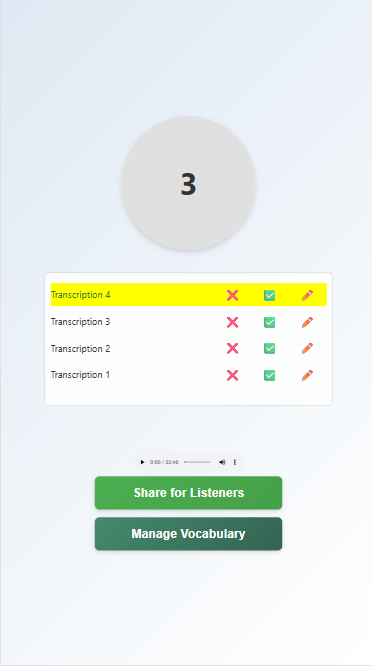
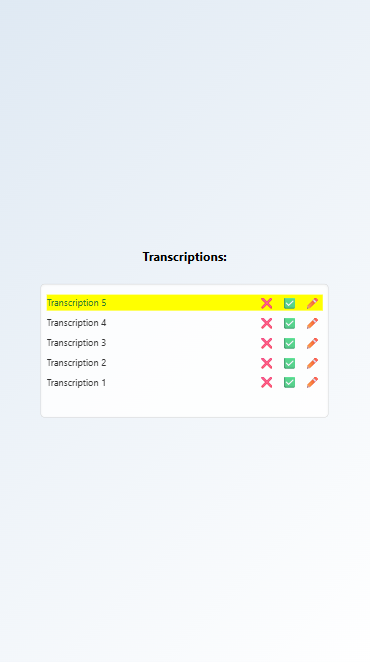

# Idea Decoder

This repository contains the code for Idea Decoder — an *automatic speech recognition* (ASR) system designed to support individuals with severe speech impairments, often combined with motor disabilities such as quadriplegia.

The prototype was developed for a young Czech-speaking girl with a permanent tracheostomy and quadriplegia. The ASR model (Whisper by OpenAI) used to transcribe her speech is based on the [TracheoSpeech_ASR](github.com/Hobit2002/TracheoSpeech_ASR) project.


##  Contents

- [User Guide](#user-guide)
- [System Architecture](#system-architecture)
- [Installation Guide](#️installation-guide)
- [Transcribing Component](#transcribing-component)
  - [Running Client](#running-client)
  - [Fine-tuning](#fine-tuning)
  - [Testing the Transcriptions](#testing-the-transcriptions)
- [Server Component](#server-component)


## User Guide

The use of **Idea Decoder** is designed to be as straightforward as possible. Assuming the transcribing component is already running (for technical details, see [System Architecture](#system-architecture) and [Transcribing Component](#transcribing-component)), the steps for the user or patient are as follows:

1. **Open the Application**  
   Navigate to [jasmiapp.onrender.com](https://jasmiapp.onrender.com) in a web browser. (Note that the server uses a different version of this repository, which is in active development, meaning that the web app might not strictly correspond to codes provided here)

2. **Speak One Word per Turn**  
   The following screen will appear. The patient is instructed to say *at most one word* during each cycle of the green timer at the top. (For our patient, we use three seconds per word. For others, this interval should be adjusted to match their speech rate.)

   

   (The audio player contains and artificial conversation, a concept detailed in [TracheoSpeech_ASR](github.com/Hobit2002/TracheoSpeech_ASR) repository, which is used to collect strongly labelled fine-tuning data)
    
3. **Provide Feedback on Transcriptions**  
   If the system recognizes speech with high confidence, transcriptions will appear as shown below (new ones are highlighted in yellow). The patient can mark each transcription as *good*, *bad*, or rewrite it manually — providing valuable training data for the system.

   

4. **Share with Listeners**  
   Since conversation partners may not see the patient's screen, clicking the `Share for Listeners` button generates a QR code link that disappears automatically after ten seconds.

   

5. **Listeners View and Give Feedback**  
   Listeners can scan the QR code and open the following page, where they can see the transcriptions and optionally provide feedback on their quality.

   

6. **Manage Vocabulary**  
   To restrict the ASR system’s transcription space, patients can create or select predefined vocabularies with a limited set of words. By clicking the `Manage Vocabulary` button, an interface opens where they can select an existing vocabulary or define a new one. (Only a rough idea of desired words is needed; the precise list is later expanded using LLMs and NLP techniques.)

   

---

>  **Important:**  
The system is not always fully operational due to limited computational resources. Before running the application, the patient or their caregiver must contact the administrator to activate transcription for the session. New vocabularies and feedback for fine-tuning are processed only *after* the session ends.

## System Architecture

The full technical details can be found in the [documentation](documentation/documentation.pdf). Here, we provide only a simple, general and informal overview of our system.


1. The system consists of a **web server**, **browser clients**, and a **transcribing client**, working together to support speech recognition for the patient. The browser client runs as a web application, accessible via any standard browser, and activates the patient's microphone upon launch.

2. The patient’s browser client also generates a **QR code link** that allows conversation partners to connect to the session via their own browser clients. These clients receive and display recognized transcriptions in real time.

3. A **transcribing client** — running on a separate, computationally powerful device — connects to the web server to handle the actual speech transcription. It receives all the audio, identifies the patient's speech and transcibes the segments that contain it.

4. The transcribing client returns transcriptions to the server, which distributes them to all connected clients. The patient and the conversation partners can provide feedback by confirming, correcting, or rejecting transcriptions. This feedback is stored for later training.

5. The web application also supports managing limited-purpose vocabularies to adapt to specific conversational contexts. Implementation-wise they follow the same information flow as the feedbacks to transcriptions.

## Installation Guide

1. Clone the repository:
   ```bash
   git clone https://github.com/Hobit2002/Idea_Decoder
   cd Idea_Decoder
   ```

2. Create a conda environment from the provided `environment.yml`:
   ```bash
   conda env create -f environment.yml
   conda activate Idea_Decoder
   ```

##   Transcribing Component

Here we discuss, how to run, improve and test the transcription component.

### Running Client

Assuming that the installation was already done, running the transcription client is straightforward.

1. Activate the conda environment.

```
conda activate Idea_Decoder
```

2. If not already available, download the speaker recognition model.

```
python download_data.py speech_detection_model_2
```

3. If not already available, download ASR model

```
python download_data.py base_adapted_patient
```

4. Run the client!

```
python transcribing_client/client_whisper.py
```

### Fine-tuning

Here we provide a step-by-step guide on how to improve the Whisper model using the data collected from the patient as well as how to collect this data.

1. After disconnecting the transcribing client from the server, copy the directory `tmp_wav` from the main directory to `data/sessions` and rename it to indicate for which recording session it stands.
2. To analyze the training logs and extract the annotations for fine-tuning, run:

```
python fine_tuning/extract_feedback.py
```

3. After obtaining a substantial amount of fine-tuning data (at least hundreds of samples, probably across several sessions), prepare the fine-tuning package by running:

```
python fine_tuning/create_public_dataset.py
```

4. Upload the data package as well as the Whisper model to Google Drive. Enable link sharing for both.
5. Open [fine_tune_on_browser_recordings.ipynb](fine_tuning/fine_tune_on_browser_recordings.ipynb) in [Google Colab](https://colab.research.google.com/) and proceed based on the instructions in the notebook. Make sure to use GPU for training (our recommendation is A100).
6. The fine-tuned Whisper model is saved on your Google Drive in the `TracheoSpeech_ASR_Checkpoints` folder; download it from there.  

### Testing the Transcriptions

Before irreversibely replacing the old model with the fine-tuned one, we recommend first setting the new model path in `transcribing_client/test_transcription_client.py`  and then inspecting its performance on the data from the last session running:

```
python transcribing_client/test_transcription_client.py
```

## Server Component

The application runs on a [Node.js](https://nodejs.org/en) server currently hosted on [Render](https://render.com/), accessible at [https://jasmiapp.onrender.com](https://jasmiapp.onrender.com).

Due to hosting constraints, opening the application after a period of inactivity typically requires over 50 seconds to load. Additionally, to make the application fully operational, the following request should be made to download supplementary data that are excluded from the repository for privacy and performance reasons. These include user-specific vocabulary configurations and, optionally, synthetic conversations used for fine-tuning:


```
https://jasmiapp.onrender.com/download
```
